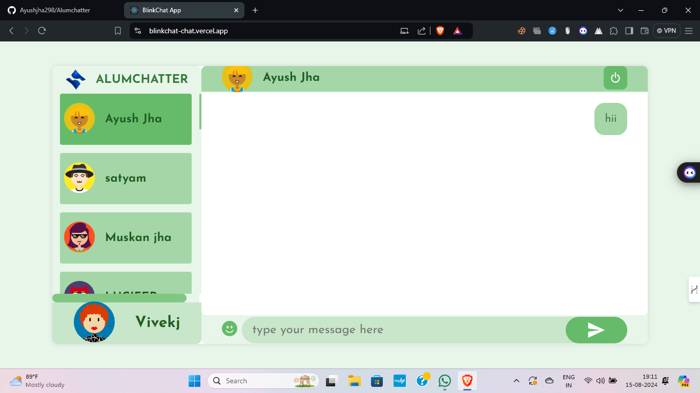
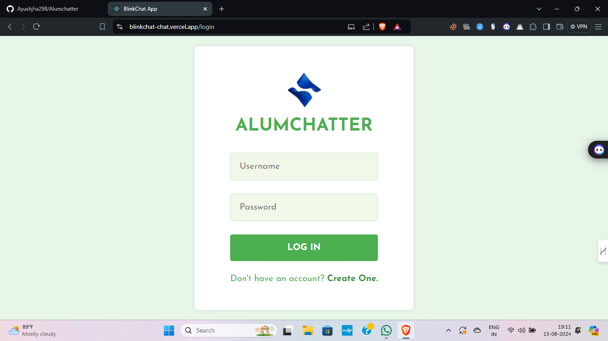

# AlumChatter

AlumChatter is a real-time chat application developed using the MERN stack, specifically designed for college alumni to connect and communicate seamlessly. The application leverages Socket.IO to provide real-time messaging, ensuring low-latency and efficient communication.

## Project Overview
AlumChatter is a real-time chat application It was designed specifically for college alumni to connect and communicate in a seamless, real-time environment.

## Features
- **User Authentication**: Secure login and registration system.
- **Real-Time Messaging**: Instant messaging.
- **Responsive UI**: Adapts to different screen sizes for a consistent experience across devices.

## Technology Stack
- **MongoDB**: NoSQL database for storing user data, messages, and chat room information.
- **Express.js**: Back-end framework for handling API requests and server logic.
- **React.js**: Front-end library for building the user interface.
- **Node.js**: JavaScript runtime for the back-end.
- **Socket.IO**: Library for enabling real-time, bidirectional communication between clients and the server.

## Screenshots

## Contact

For any questions or feedback, please reach out to [ayushjha298@gmail.com](mailto:ayushjha298@gmail.com).